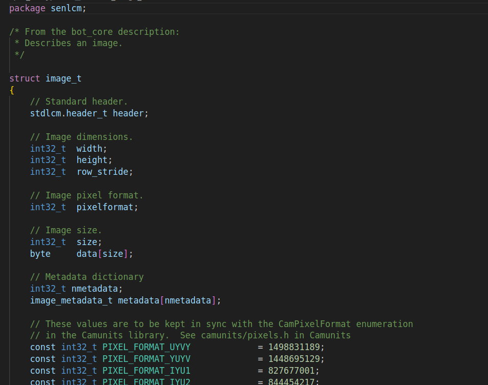

# LCM Syntax Highlighting

This extension provides syntax highlighting for [Lightweight Communications and Marshalling](https://lcm-proj.github.io/) (LCM) type definition files (.lcm) in Visual Studio Code.

## Features

- Syntax highlighting for LCM type definition files
- Support for primitive types, arrays, constants, and enumerations

## :hammer: Installation

### Visual Studio Code Marketplace

1. Open VS Code
2. Go to Extensions (Ctrl+Shift+X)
3. Search for "LCM Syntax Highlighting"
4. Click Install

### From Source

1. Clone this repository
    ```bash
    git clone git@github.com:mbari-org/lcm-syntax-highlighting.git
    ```
2. Build the extension
    ```bash
    cd lcm-syntax-highlighting
    npx @vscode/vsce package
    ```
3. Install the extension
    ```bash
    code --install-extension lcm-syntax-highlighting-*.vsix
    ```

## :rocket: Usage
Open a `.lcm` file in VS Code:

